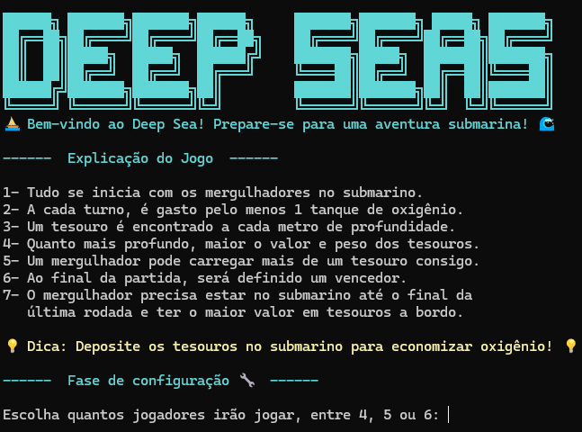

# 🌊 Deep Sea Game

Um jogo desenvolvido em **Python** durante o curso **Algoritmos e Programação em Python**, oferecido pela **Universidade Estadual de Feira de Santana (UEFS)**.

## Sobre o projeto

O **Deep Sea** é um projeto desenvolvido durante o curso **Algoritmos e Programação em Python** da **Universidade Estadual de Feira de Santana (UEFS)**, com o objetivo de colocar em prática os conceitos aprendidos ao longo das aulas.

O repositório reúne **duas versões do jogo**, representando a evolução do projeto durante o curso:

- **DeepSea.py**: versão executada no **terminal**, desenvolvida para praticar lógica de programação, estruturas de controle e interação por meio do console.
- **DeepSea2.py**: versão desenvolvida com a biblioteca **Pygame**, que utiliza interface gráfica, imagens e movimentação dos elementos do jogo.

As duas versões demonstram a evolução do projeto, desde uma implementação em modo texto até uma versão gráfica, aplicando os conhecimentos adquiridos em programação e desenvolvimento de jogos com Python.